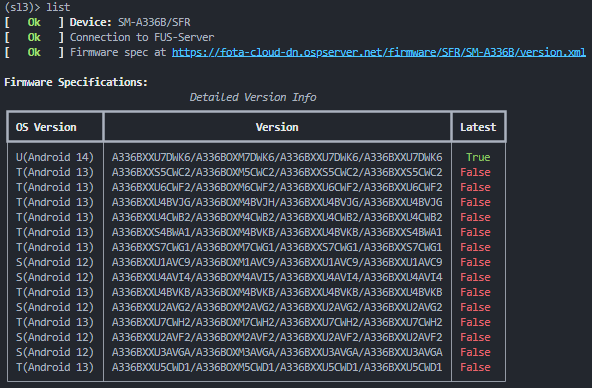

.. _examples:

========
Examples
========

List firmware information
-------------------------

Utilizing the ``list`` command you can list all available firmwares for a specific model within
the selected region.

.. note::
    Make sure to always set the device's model name and region code, otherwise you won't get any
    valid results. For simplicity, we don't write the model and region code explicitly.

Using this command without any arguments will result in a table view that displays all available
versions:

.. note::
    If you just want to list the latest firmware use `-l` and if you want to print out the version
    strings only, use `-q`. Using `-v VERSION` you can also view details on one specific version.

Download Firmware
-----------------

With this updated version of `samloader`, you can download multiple firmware files at one (though, most likely not a real use case) and accelerate to the maximum download speed. Using one version
string from the output before, simply run the following command:

.. code-block:: console

    (sl3)> download -o "/path/to/destination/" "$version1" "$version2" ...

As these files can be huge, once canceled, the donwload will resume at the current download
position. You can disable that behaviour using `--no-cache`. With a special version identifier (`*`) you can download all firmware binaries at once.

.. warning::
    Because of some issues with python.rich, parallel download is disabled by default. It can be
    enabled using `--parallel`.

To decrypt files directly after downloading them, use `--decrypt`.

Decrypt Firmware
----------------

The decryption command (`decrypt`) is designd to operate on one file only. You just have
to provide a version number and the file path:

.. code-block:: console

    (sl3)>  decrypt -v "$version" "/path/to/firmware.zip.enc4"

.. note::
    If you only want to generate the decryption key, use `--key-only`. Note that the actual
    key is the MD5 value